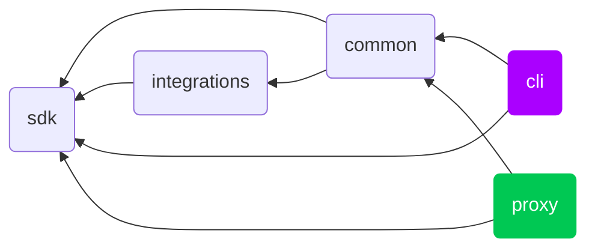

# Contributing

Hi there 👋, we're excited 🤗 that you're interested in contributing to Configu! Your contributions enrich the Configu experience and make it better every day 🤩.

Please take a moment to review this document in order to make the contribution process easy and effective for everyone involved.

Following these guidelines helps to communicate that you respect the time of the developers managing and developing this open source project. In return, they should reciprocate that respect in addressing your issue, assessing changes, and helping you finalize your pull requests.

We ask all contributors to abide by our [Code of Conduct](https://github.com/configu/configu/blob/main/.github/CODE_OF_CONDUCT.md). This helps ensure a positive and productive environment for everyone.

## Reporting Issues and Asking Questions

Before opening an issue, please search the [issue tracker](https://github.com/configu/configu/issues) to make sure your issue hasn't already been reported.

### Bugs and Improvements

We use the issue tracker to keep track of bugs and improvements to Configu itself, its examples, and the documentation. We encourage you to open issues to discuss improvements, architecture, theory, internal implementation, etc. If a topic has been discussed before, we will ask you to join the previous discussion.

### Getting Help

**For support or usage questions like “how do I do X with Configu” and “my code doesn't work”, please search and ask on [Stack Overflow with a Configu tag](https://stackoverflow.com/questions/tagged/configu?sort=votes&pageSize=50) first.**

We ask you to do this because StackOverflow has a much better job at keeping popular questions visible. Unfortunately good answers get lost and outdated on GitHub.

Some questions take a long time to get an answer. **If your question gets closed, or you don't get a reply on Stack Overflow for longer than a few days,** we encourage you to post an issue linking to your question. We will close your issue but this will give people watching the repo an opportunity to see your question and reply to it on StackOverflow if they know the answer.

Please be considerate when doing this as this is not the primary purpose of the issue tracker.

### Help Us Help You

On both websites, it is a good idea to structure your code and question in a way that is easy to read to entice people to answer it. For example, we encourage you to use syntax highlighting, indentation, and split text in paragraphs.

You can make it easier for us if you provide versions of the relevant libraries and a runnable small project or test case reproducing your issue.

## Development

This repository is a [monorepo](https://trunkbaseddevelopment.com/monorepos/). This means there are multiple packages managed in this codebase, even though we publish them as separate packages.

It is powered by [node.js](https://nodejs.org/) and [pnpm](https://pnpm.io/) and uses [husky](https://typicode.github.io/husky/) and [lint-staged](https://github.com/lint-staged/lint-staged) to enforce its coding guidelines.

To see the full list of prerequisites, check out the `engines` property in the main [`package.json`](https://github.com/configu/configu/blob/main/package.json#L7) file.

#### Cloud Development Environment

Instantly start experimenting and developing.

 
 

### Local environment

- Install git
- Install Node.js and Npm according to the `.nvmrc` file.
  - We recommend [installing node.js via a package manager](https://nodejs.org/en/download/package-manager/).
- Install `monorepo` dependencies by running `npm i` in the root directory.
  - Alternatively, bootstrap the whole `monorepo` by running `.devcontainer/bootstrap.sh` script in the root directory.

### Repository Structure

#### **/**

The [root](https://github.com/configu/configu/blob/main/package.json) directory serves as the skeleton for the Configu project and provides the resources needed for developers to build and contribute to it.

#### **examples/**

The [./examples](https://github.com/configu/configu/tree/main/examples) directory demonstrates various concepts and best practices with some real-world use-cases of Configu.

#### **docs/**

The [./docs](https://github.com/configu/configu/tree/main/docs) directory holds the official Configu docs. Improvements to the documentation are always welcome. We use [Mintlify](https://mintlify.com/) to build and host our documentation website. The website is published automatically whenever the `main` branch is updated.

#### **./packages**

- [./packages/sdk](https://github.com/configu/configu/tree/main/packages/sdk): The core SDK that contains the core Configu logic and interfaces
  - [./packages/sdk/src/stores](https://github.com/configu/configu/tree/main/packages/ts/src/stores): [ConfigStores](https://configu.com/docs/config-store/) supported shipped together with the core SDK
  - [./packages/sdk/src/commands](https://github.com/configu/configu/tree/main/packages/ts/src/commands): [Commands](https://configu.com/docs/commands/) supported shipped together with the core SDK
- [./packages/integrations](https://github.com/configu/configu/tree/main/packages/integrations): Contains all the packages that extend the SDK interfaces
  - [./packages/integrations/expressions/validators/src](https://github.com/configu/configu/tree/main/packages/integrations/expressions/validators/src): Contains all validator integrations
  - [./packages/integrations/formatters](https://github.com/configu/configu/tree/main/packages/integrations/formatters): Contains all formatter integrations
  - [./packages/integrations/stores](https://github.com/configu/configu/tree/main/packages/integrations): Contains all [ConfigStore](https://configu.com/docs/config-store/) integrations
- [./packages/common](https://github.com/configu/configu/tree/main/packages/common): Shared code for both Configu Proxy and Configu CLI, extends the Configu SDK
- [./packages/proxy](https://github.com/configu/configu/tree/main/packages/proxy): Configu Proxy, which is built using [fastify](https://fastify.dev/) and the Common package
- [./packages/cli](https://github.com/configu/configu/tree/main/packages/cli): Configu CLI, which is built using [oclif](https://oclif.io/) and the Common package

### Sending a Pull Request

For non-trivial changes, please open an issue with a proposal for a new feature or refactoring before starting on the work. We don't want you to waste your efforts on a pull request that we won't want to accept.

On the other hand, sometimes the best way to start a conversation _is_ to send a pull request. Use your best judgment!

In general, the contribution workflow looks like this:

- Open a new issue in the [Issue tracker](https://github.com/configu/configu/issues).
- Fork the repo.
- Create a new feature branch based off the `main` branch.
- Make sure all tests pass and there are no linting errors.
- Submit a pull request, referencing any issues it addresses.

Please try to keep your pull request focused in scope and avoid including unrelated commits.

After you have submitted your pull request, we'll try to get back to you as soon as possible. We may suggest some changes or improvements.

## Resources

> Working on your first Pull Request? You can learn how from this _free_ series, [How to Contribute to an Open Source Project on GitHub](https://egghead.io/courses/how-to-contribute-to-an-open-source-project-on-github).

- [Open Source Guides](https://opensource.guide/how-to-contribute/)
- [GitHub Help](https://help.github.com)
- [About Pull Requests](https://help.github.com/articles/about-pull-requests/)
- [Make a Pull Request](http://makeapullrequest.com/)
- [First Timers Only](http://www.firsttimersonly.com/)
- [JavaScript Standard Style](https://standardjs.com/)

---

Thank you 💙 for considering contributing to Configu! We look forward to working with you 🤝.
